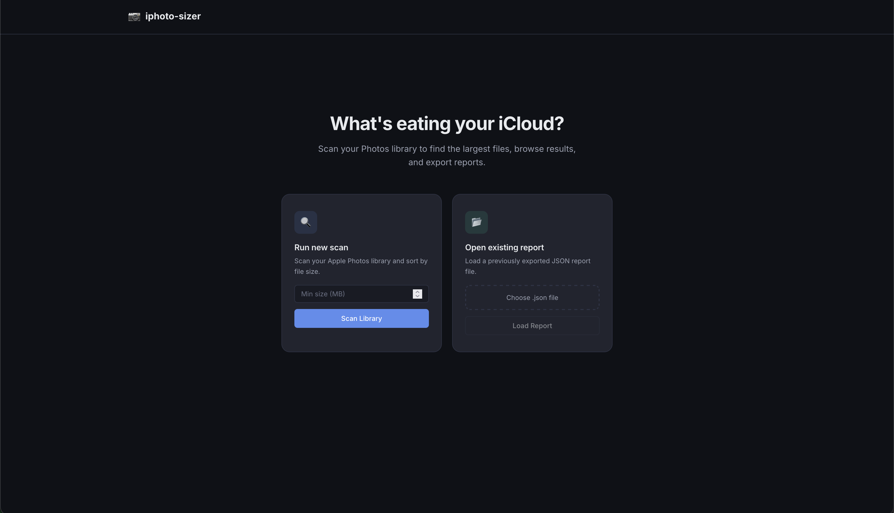
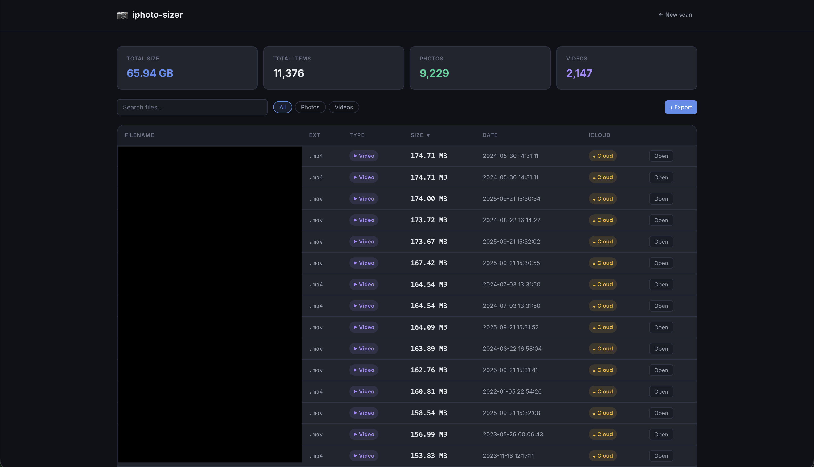

# iphoto-sizer

Exports metadata from your macOS Apple Photos library to CSV or JSON, sorted by file size (largest first). Useful for finding what's eating your iCloud storage.

Includes an optional web UI for browsing, filtering, and exporting results from your browser.

## Screenshots

| Landing Page | Scan Results |
|---|---|
|  |  |

## Prerequisites

- macOS with the Photos app and a library present
- Python 3.11+
- Full Disk Access granted to your terminal (System Settings > Privacy & Security > Full Disk Access)

## Install

From PyPI:

```bash
pip install iphoto-sizer
```

With the optional web UI:

```bash
pip install iphoto-sizer[web]
```

Or with uv:

```bash
uv tool install iphoto-sizer        # CLI only
uv tool install iphoto-sizer[web]   # CLI + web UI
```

Or from source:

```bash
git clone https://github.com/spencerpresley/iPhotoSizer.git && cd iPhotoSizer
uv sync              # CLI only
uv sync --extra web  # CLI + web UI
```

## Usage

### CLI

```bash
# Export everything to photos_report.csv in the current directory
iphoto-sizer

# Only items larger than 100 MB
iphoto-sizer --min-size-mb 100

# Write to a specific path
iphoto-sizer -o ~/Desktop/large_files.csv

# Export as JSON instead of CSV
iphoto-sizer -f json -o ~/Desktop/photos.json

# Combine options
iphoto-sizer --min-size-mb 500 -f json -o ~/Desktop/big_ones.json
```

You can also run it as a module:

```bash
python -m iphoto_sizer
```

### Web UI

```bash
iphoto-sizer --web
```

Opens a local web server in your browser where you can:

- Run a new scan or open an existing JSON report
- Browse all items with sorting, filtering, and search
- View summary stats (total size, item counts, video/photo breakdown)
- Export results to CSV, JSON, or both
- Open individual photos directly in Photos.app (experimental)

## CLI Options

| Flag | Description | Default |
|------|-------------|---------|
| `--min-size-mb` | Only include items at or above this size (MB) | `0` (all items) |
| `-o`, `--output` | Output file path | `photos_report.csv` |
| `-f`, `--format` | Output format: `csv` or `json` | `csv` |
| `--web` | Launch the web UI in a browser | off |

## Output

**CSV columns / JSON fields:**

`filename`, `extension`, `media_type`, `size_bytes`, `size`, `creation_date`, `uuid`, `icloud_status`

- `size` is human-readable (e.g. `"150.23 MB"`, `"1.50 GB"`)
- `icloud_status` is `"local"` if the original file is on disk, `"cloud-only"` if it only exists in iCloud
- Records are sorted by `size_bytes` descending

A summary of total items, total size, and the 10 largest files is printed to stderr after export.

## Notes

- Full Disk Access is required because the tool reads the Photos library's SQLite database directly (via [osxphotos](https://github.com/RhetTbull/osxphotos)). Grant it to your terminal app in System Settings > Privacy & Security > Full Disk Access.
- Initial library load typically takes 5-20 seconds depending on library size.
- Photos that fail to parse are skipped with a warning; they don't stop the export.
- The tool checks for at least 50 MB of free disk space before writing.
